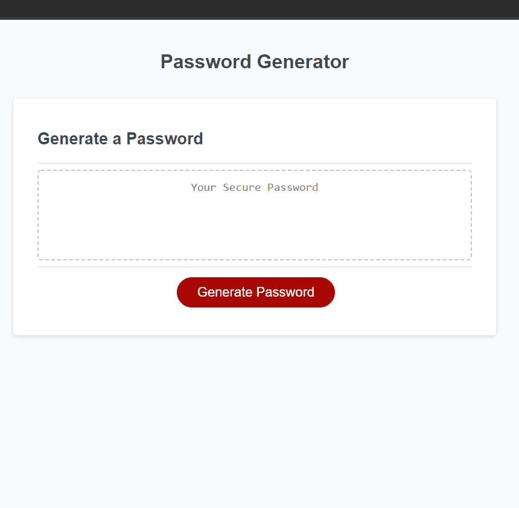

# Bootcamp Week 3 Homework

## Password Generator

Our third homework for coding bootcamp. This is to showcase what I've learned in the third week of the bootcamp.

## The tasks include

- To generate a password when button is clicked
- To ask the user the length of the password
- To ask the user what type of characters to include in their password
- To make sure password length is at least 8 characters and no more than 128 characters

## Sample of the app

## You can view the finished product here

https://carlsantiago.github.io/password-generator/

---

© Carl Santiago\
📧 4518gg@gmail.com
